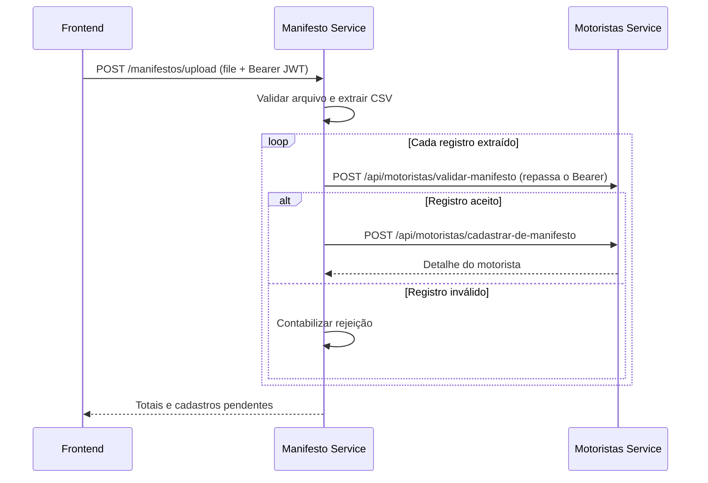

# NEWELOG | Serviço de manifestos

Microserviço responsável por receber manifestos em CSV, extrair os registros e integrar a importação com o serviço de motoristas do NEWELOG.

Parte do Projeto Integrador do 3º semestre de DSM da FATEC São José dos Campos, desenvolvido pela **Koitech-Log** para a **NEWE Logística Integrada**.

[Projeto principal](https://github.com/Koitech-Log/Koitech-Log-3DSM-Newelog) · [Serviço de motoristas](https://github.com/Koitech-Log/newelog-motoristas-service) · [Frontend](https://github.com/Koitech-Log/newelog-frota-web) · [Documentação](https://github.com/Koitech-Log/Documentos)

## Como funciona



Este serviço não possui banco de dados próprio. O serviço de motoristas concentra o cadastro, as viagens e a persistência. O processamento é síncrono e percorre os registros sequencialmente.

## Tecnologias

| Tecnologia | Versão / uso |
| --- | --- |
| Java | JDK 21 (POM, CI e containers) |
| Spring Boot | 4.1.1 |
| Spring Web MVC | API de upload |
| Spring Security | Resource server: valida o JWT do `newelog-auth-service` |
| OpenCSV | 5.9, leitura do arquivo |
| RestTemplate | Integração HTTP com motoristas (com timeouts) |
| Spring Boot Actuator | Saúde da aplicação |
| Maven Wrapper | Build e testes |

## Executar localmente

Pré-requisitos: Git, JDK 21, o `JWT_SECRET` do `newelog-auth-service` e o [serviço de motoristas](https://github.com/Koitech-Log/newelog-motoristas-service) disponível com seu banco configurado.

```bash
git clone https://github.com/Koitech-Log/newelog-manifesto-service.git
cd newelog-manifesto-service
export JWT_SECRET='<o mesmo segredo do auth-service, mín. 32 caracteres>'
./mvnw spring-boot:run
```

No PowerShell, use `$env:JWT_SECRET = '...'` e `./mvnw.cmd spring-boot:run`.

Por padrão, a API inicia em `http://localhost:8081` e se conecta ao serviço de motoristas em `http://localhost:8080`.

```bash
curl http://localhost:8081/actuator/health
```

O health check da aplicação não comprova que uma importação conseguirá acessar o serviço de motoristas; confira também a disponibilidade dele.

## Variáveis de ambiente

| Variável | Padrão | Finalidade |
| --- | --- | --- |
| `JWT_SECRET` | — (**obrigatória**) | Mesmo segredo do `newelog-auth-service`, mínimo 32 caracteres. A aplicação não sobe sem ele |
| `PORT` | `8081` | Porta HTTP |
| `MOTORISTAS_SERVICE_URL` | `http://localhost:8080` | URL base do serviço de motoristas, sem `/api/motoristas` |
| `FRONTEND_URL` | `http://localhost:5173` | Origem permitida pelo CORS |
| `MAX_UPLOAD_SIZE` | `10MB` | Tamanho máximo do CSV (multipart) |
| `MOTORISTAS_CONNECT_TIMEOUT_MS` | `5000` | Timeout de conexão com o motoristas-service |
| `MOTORISTAS_READ_TIMEOUT_MS` | `30000` | Timeout de leitura de cada chamada ao motoristas-service |

Exporte as variáveis no terminal antes de iniciar o processo. O Spring Boot não carrega automaticamente um `.env` apenas por ele existir na raiz.

Exemplo no PowerShell:

```powershell
$env:JWT_SECRET = '<segredo do auth-service>'
$env:MOTORISTAS_SERVICE_URL = 'http://localhost:8080'
$env:FRONTEND_URL = 'http://localhost:5173'
./mvnw.cmd spring-boot:run
```

### Docker

Com o serviço de motoristas acessível pela porta `8080` do host, no Docker Desktop:

```bash
docker build -t newelog-manifesto-service .
docker run --rm -p 8081:8081 -e JWT_SECRET="$JWT_SECRET" -e MOTORISTAS_SERVICE_URL=http://host.docker.internal:8080 newelog-manifesto-service
```

Em Linux com Docker Engine, pode ser necessário acrescentar `--add-host=host.docker.internal:host-gateway`. Se ambos estiverem em uma rede Docker compartilhada, configure a URL usando o nome do serviço nessa rede. `localhost` dentro do container não aponta para outro container ou para o host.

## Autenticação

Todas as rotas, exceto `/actuator/health` e `/actuator/info`, exigem `Authorization: Bearer <jwt>` emitido pelo `newelog-auth-service`: assinatura HS256 com `JWT_SECRET`, `iss = newelog-auth-service` e claim `perfil` = `GESTOR` ou `OPERADOR`. Ambos os perfis podem importar manifestos.

Sem token ou com token inválido/expirado, a resposta é `401`; com perfil desconhecido, `403`. O serviço **repassa o mesmo `Authorization`** às chamadas ao motoristas-service, que também valida o token, por isso o `JWT_SECRET` deve ser idêntico nos três serviços.

## API de upload

| Método | Rota | Finalidade |
| --- | --- | --- |
| `POST` | `/manifestos/upload` | Importar CSV via `multipart/form-data` |
| `GET` | `/actuator/health` | Saúde da aplicação |
| `GET` | `/actuator/info` | Informações expostas pelo Actuator |

O arquivo deve ser enviado no campo **`file`**:

```bash
curl -X POST http://localhost:8081/manifestos/upload \
  -H "Authorization: Bearer $TOKEN" -F "file=@manifesto.csv"
```

No Windows PowerShell, use `curl.exe` se `curl` estiver associado a outro comando. Ao usar `FormData` no navegador, deixe que ele defina o `Content-Type` e o boundary.

Exemplo ilustrativo de resposta:

```json
{
  "mensagem": "Processado: 2 manifestos (2 cadastrados/atualizados, 0 rejeitados)",
  "nomeArquivo": "manifesto.csv",
  "totalProcessados": 2,
  "totalCadastrados": 2,
  "totalRejeitados": 0,
  "novos": []
}
```

`totalProcessados` conta as linhas de dados lidas, inclusive as descartadas por estarem malformadas (que também entram em `totalRejeitados`). `totalCadastrados` conta linhas cujo cadastro/atualização retornou sucesso, não motoristas únicos nem somente cadastros novos. `novos` lista motoristas com `cadastroValidado=false`, deduplicados por CPF dentro do upload; pode incluir pendências de importações anteriores.

## Formato do CSV

O parser usa **posições fixas**, não nomes de colunas. Um CSV genérico com apenas nome, CPF e placa não atende ao contrato.

- Extensão `.csv` e arquivo não vazio.
- Codificação `ISO-8859-1`.
- Separador `;`.
- Primeira linha ignorada como cabeçalho.
- Pelo menos **60 colunas** por linha de dados.
- Data no formato `dd/MM/yyyy`.
- Valores monetários no formato brasileiro, por exemplo `1.234,56`.

Posições utilizadas, numeradas a partir de **1**:

| Coluna | Campo extraído |
| --- | --- |
| 1 | Identificador do manifesto |
| 3 | Data |
| 4 | Nome do motorista |
| 5 | CPF do motorista |
| 16 | Nome do agregado |
| 17 | CPF/CNPJ do agregado |
| 20 | Placa do veículo |
| 39 | Valor do frete |
| 52 | Total de despesas |
| 57 | Saldo a pagar |
| 60 | Status |

O extrator remove a pontuação dos documentos e converte a data para `yyyy-MM-dd`. A validação de CPF/CNPJ e das demais regras de cadastro ocorre no serviço de motoristas.

## Erros e limites de processamento

| Situação | Comportamento |
| --- | --- |
| Sem token, inválido ou expirado | `401` |
| Perfil sem permissão | `403` |
| Arquivo vazio, extensão inválida ou CSV ilegível | `400` |
| Tamanho acima de `MAX_UPLOAD_SIZE` | `413` |
| Linha malformada (menos de 60 colunas, data ou valor ilegível) | Descartada, conta como rejeitada e o arquivo segue |
| Validação do registro retorna `400` | Conta uma rejeição e segue |
| Cadastro retorna `400` ou `409` | Conta uma rejeição e segue |
| motoristas-service responde `401`/`403` | Interrompe o upload com o mesmo status |
| motoristas-service responde `5xx` ou está fora do ar | Interrompe o upload com `502` |
| Erro inesperado | `500` com mensagem genérica (detalhes só no log) |

Os erros usam o corpo `timestamp` + `mensagem`. Linhas totalmente em branco são ignoradas sem contar. Valor monetário **vazio** vale zero; valor preenchido mas ilegível rejeita a linha.

Não há transação única para todo o arquivo: registros já persistidos pelo serviço de motoristas permanecem salvos se uma chamada posterior interromper o upload. A resposta não traz o motivo detalhado de cada rejeição; os motivos ficam no log. O processamento é síncrono, com duas chamadas HTTP por linha; arquivos muito grandes podem demorar.

## Estrutura

```text
newelog-manifesto-service/
├── src/main/java/br/com/newelog/
│   ├── config/          # Segurança (JWT/CORS) e RestTemplate
│   ├── controller/      # Upload e tratamento de erros
│   ├── dto/             # Dados extraídos e respostas
│   ├── service/         # Parser CSV, processamento e cliente de motoristas
│   └── validation/      # Validação do arquivo
├── src/main/resources/application.properties
├── src/test/            # JWT, extrator de CSV, cliente de motoristas e contexto
├── .github/workflows/ci.yml
├── Dockerfile
├── mvnw / mvnw.cmd
└── pom.xml
```

## Testes e build

```bash
./mvnw test
./mvnw clean verify
```

No PowerShell, use `./mvnw.cmd`. O workflow do GitHub Actions executa `clean verify` com Java 21 em pushes e pull requests para `main`. A suíte cobre a validação do JWT, o extrator de CSV (linhas malformadas) e o tratamento de erros do cliente de motoristas; não substitui um teste de integração com o motoristas-service real.

Consulte o [README de motoristas](https://github.com/Koitech-Log/newelog-motoristas-service#readme) para regras de persistência, status e prevenção de viagens duplicadas.
